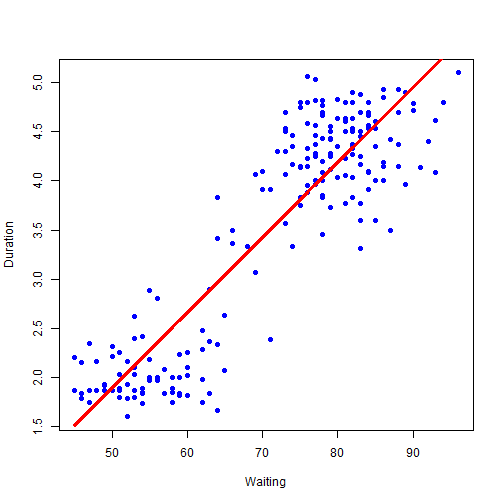

## Linear regression

Linear regression is an approach for modeling the relationship between a scalar dependent variable y and one or more explanatory variables denoted X.

Data are modeled using linear predictor functions, and unknown model parameters are estimated from the data. Such models are called linear models. Most commonly, linear regression refers to a model in which the conditional mean of y given the value of X is an affine function of X.


Thus the model takes the form  y = <b>intercept</b> + <b>slope</b> X

---

## Linear regression with R language

```
library(shiny); library(caret); data(faithful); set.seed(333)
# Partition the data set to a training dataset and a test dataset
inTrain <- createDataPartition(y=faithful$waiting, p=0.75, list=FALSE)
trainFaith <- faithful[inTrain,]; 
testFaith <- faithful[-inTrain,]
# Create the regression model by calling the lm function
lm1 <- lm(eruptions ~ waiting, data=trainFaith)
pv <- predict(lm1,data.frame(waiting=65))
# Plot the data
plot(trainFaith$waiting, trainFaith$eruptions, pch=19, col="blue", xlab="Waiting", ylab="Duration")
# plot the estimated regression line
lines(trainFaith$waiting, lm1$fitted, col = blue, lwd = 3)    
# Calculate RMSE on the training dataset
sqrt(sum((lm1$fitted-trainFaith$eruptions)^2))
# Calculate RMSE on the test dataset
sqrt(sum((predict(lm1, newdata=testFaith)-testFaith$eruptions)^2))

```

---

## Output of the example

```
## Loading required package: lattice
## Loading required package: ggplot2
```

The predicted duration of 65 is  3.0378
The RMSE on training set is 7.2715 and the RMSE on testing set is 3.7032
 


--- &radio

## Quiz

What we use to reduce the dimension of a problem?

1. linear regression
2. SVM
3. _PCA_
4. KNN

***.hint 
It uses an orthogonal transformation to convert a set of observations of possibly correlated variables into a set of values of linearly uncorrelated variables.

***.explanation Principal component analysis (PCA) is a statistical procedure that uses an orthogonal transformation to convert a set of observations of possibly correlated variables into a set of values of linearly uncorrelated variables called principal components. 
